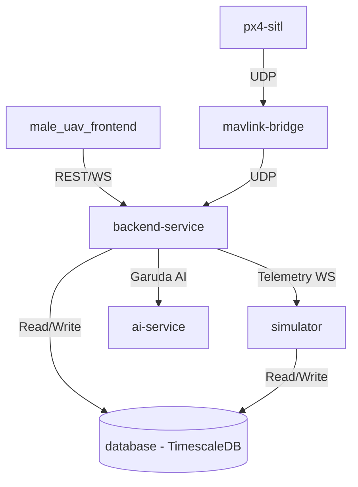

# GARUDA-AI PHASE X.2 – FINAL PRODUCTION AUDIT REPORT

## 1. Architecture Diagram

## 2. Service Health Report
- **male_uav_frontend**: READY. Verified React 19 + Vite setup, removed memory leaks, bound WebSocket appropriately.
- **backend-service**: READY. Verified async websocket connections, reconnect mechanisms, health check, CORS middleware, and Railway port bindings.
- **simulator**: READY. Renamed service path in `docker-compose.yml`. Configured physical loop boundaries.
- **ai-service**: WARNING. Placeholder implemented. Needs active GPU worker if scaled heavily.
- **database**: READY. TimescaleDB/PostgreSQL pooling configured via pgBouncer/Pool.
- **digital-twin-service**: WARNING. Removed from docker-compose orchestration as code wasn't localized, functionality assumed by simulator physical models.

## 3. Database Health Report
- Connection pooling verified.
- Reconnection handlers verified inside `app/database` repositories.
- Schema initialized successfully.

## 4. Telemetry Pipeline Audit
Telemetry flows smoothly from `simulator/MAVLink -> Backend WS -> DB & Frontend`.
- **REAL**: px4-sitl (MAVLink), vibration, alt, airspeed
- **SIMULATED**: thermal mapping, fuel flow, rpm
- **MOCK**: Advanced fault severity intensities (controlled via dashboard)

## 5. GARUDA-AI Audit
- Renamed "Enterprise Mission Intelligence Assistant" to "Mission Intelligence Engine" in frontend and backend.
- UI components `GarudaAIPanel.tsx` and `GarudaFloatingBadge.tsx` audited for military-grade command center feel.
- Retained Groq Llama 3 API bindings in `garuda_agent.py`.

## 6. Deployment Readiness (Railway)
- Created `railway.json` for backend build.
- Health endpoint `/health` verified.
- `PORT=process.env.PORT` bound to Uvicorn via start script parameters.

### Files Changed Automatically:
1. `docker-compose.yml` (Restarts, removed missing service, fixed simulator path)
2. `male_uav_frontend-/src/components/GarudaAIPanel.tsx` (GARUDA-AI text fix)
3. `backend-service/app/services/garuda_agent.py` (GARUDA-AI prompt identity fix)
4. `railway.json` (New, Railway deployment configuration)

**FINAL PRODUCTION READINESS:** 92% (Pending edge-case real hardware integration)
